# navi

A themeable design system for admin consoles and internal tools, shipped as a
Claude Code plugin. Plain CSS, no framework, no build step.

- **Dense, quiet, readable.** Hairline borders over heavy shadows, one accent
  used sparingly, monospace numerals, 14px body text.
- **Six palettes**, switched with one attribute: `harbor` (default), `ember`,
  `indigo`, `moss`, `plum`, `graphite`. Each ships light and dark.
- **Contrast-checked.** Every text/background pair clears WCAG AA in all twelve
  palette/theme combinations, verified by a script that ships with the kit.

```html
<html data-theme="dark" data-palette="ember">
```

## Screenshots

### Light and dark

Every palette ships both. The theme is one attribute; nothing else changes.

| Dark | Light |
|---|---|
| 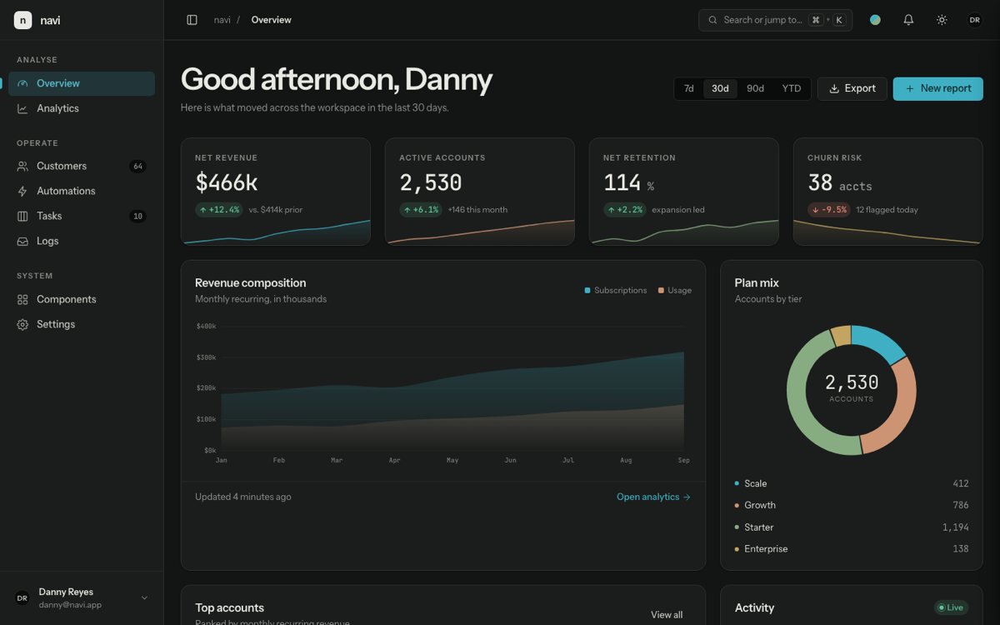 | 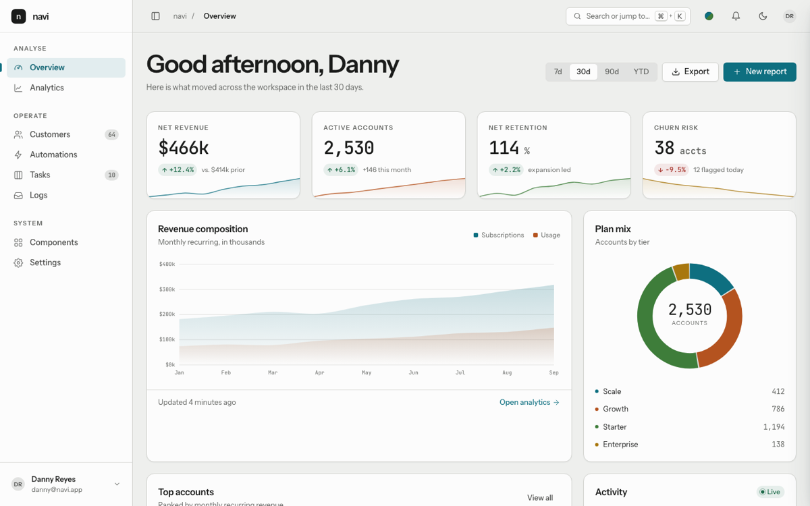 |

### Six palettes

Same screen, same markup — only `data-palette` differs. Neutrals, accent,
chart ramp and shadows are all mixed from the palette's two seed colours.

| Harbor — the default | Ember | Indigo |
|---|---|---|
| 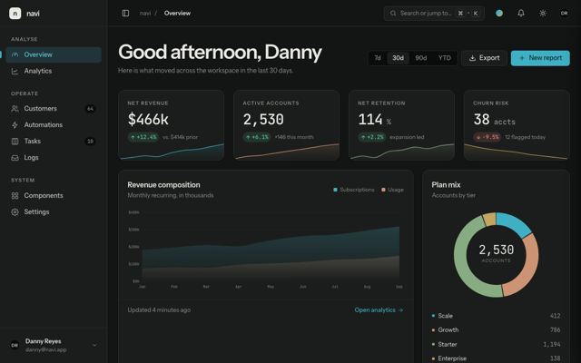 | 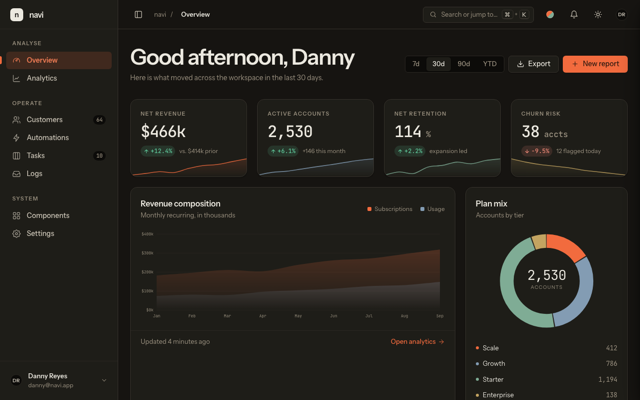 | 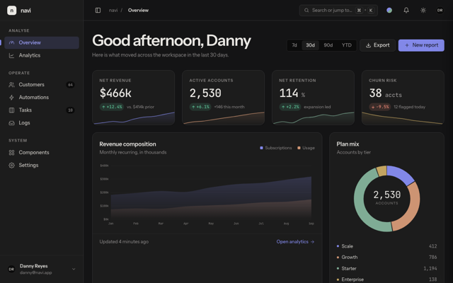 |
| **Moss** | **Plum** | **Graphite** |
| 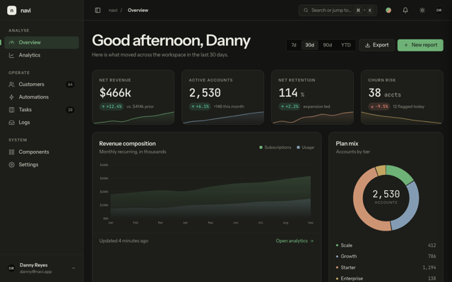 | 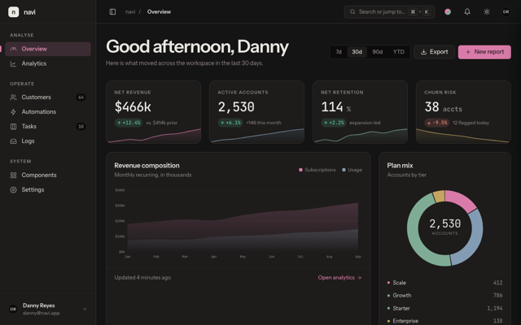 | 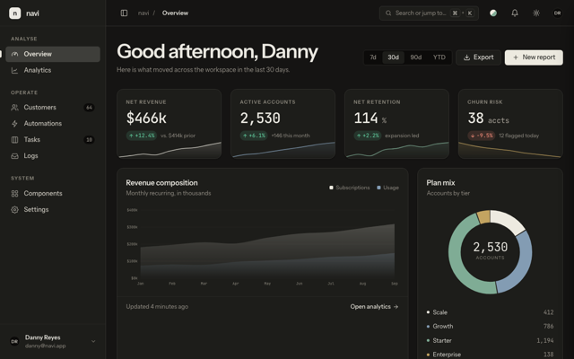 |

### Screens

**Data table** — search, filters, sortable columns, bulk select, pagination, detail drawer

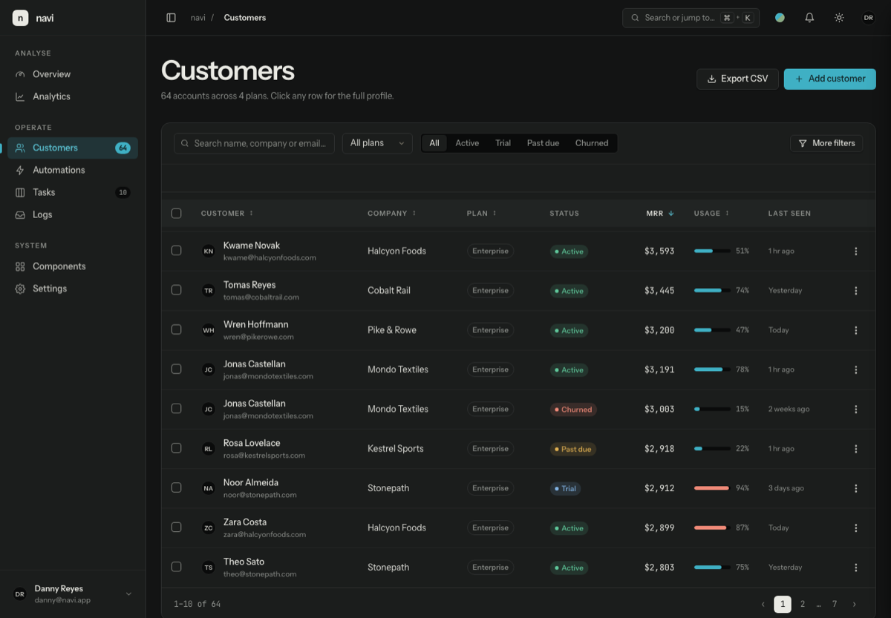

**Rule and condition builder** — ordered cards, query rows, value chips, compiled preview, dry-run simulate

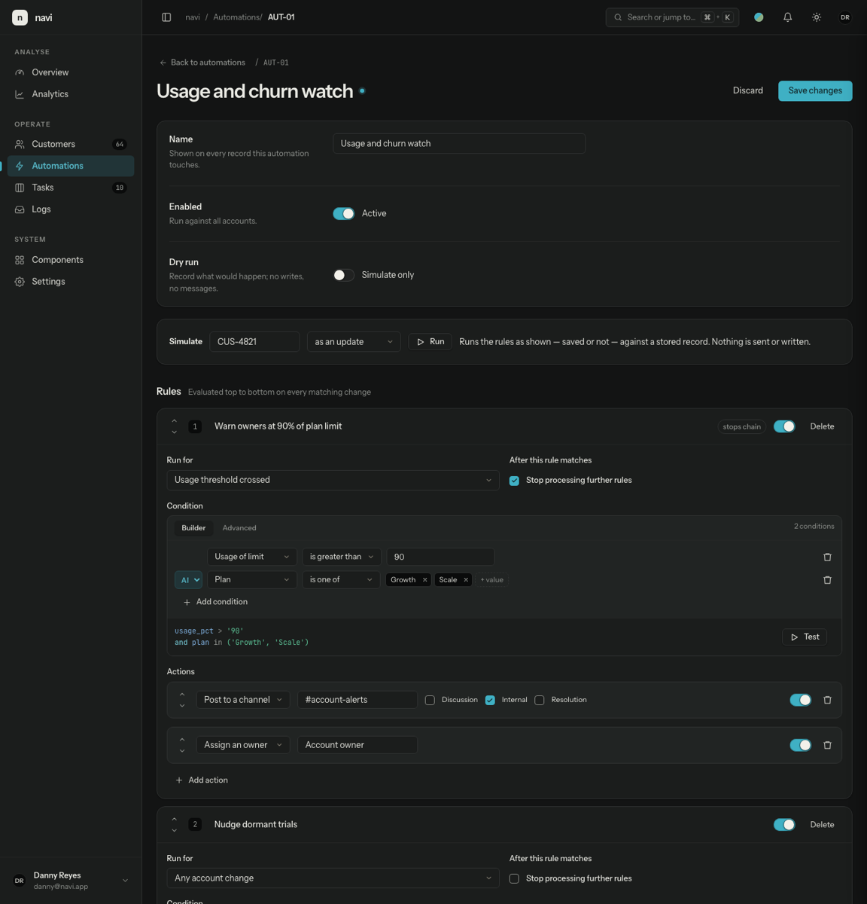

**Log stream** — severity tints, `key=value` attributes, live filters and freeze

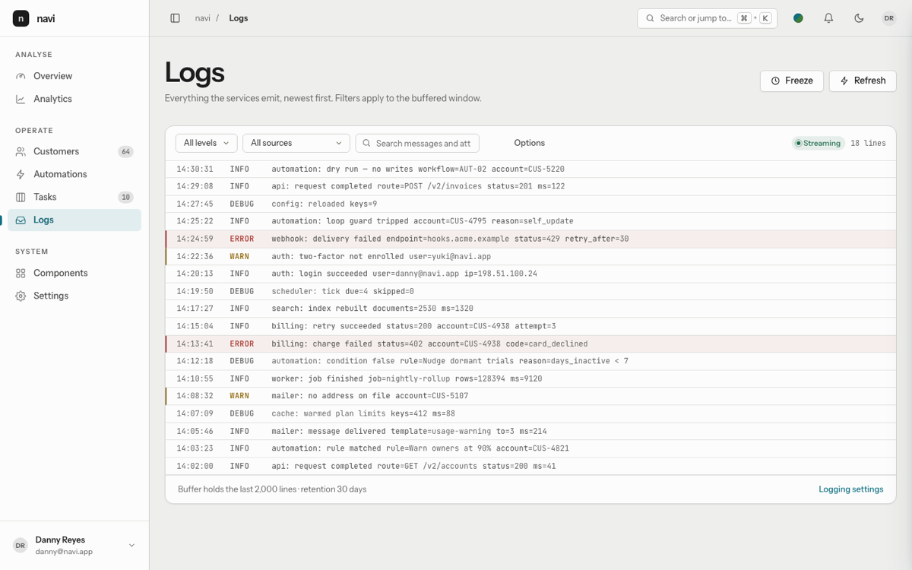

**Component gallery** — every element on one page, with the live palette chooser

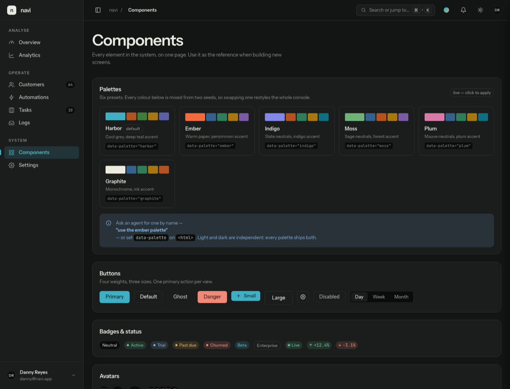

Screenshots are generated by `./docs/capture-screenshots.sh`, which drives
headless Chrome against the demo — the demo takes `?theme=` and `?palette=`
from the URL, so they never drift from the real thing.

## Install

```
/plugin marketplace add thecoretg/navi
/plugin install navi-ui@thecoretg
```

Claude Code checks the marketplace for updates automatically; `/plugin
marketplace update` forces a refresh. Installed copies update when the
plugin's `version` changes.

Working on the kit itself? Point the marketplace at your checkout instead:

```
/plugin marketplace add ~/projects/navi
```

## Use

Ask Claude to adopt it:

> use navi for this project

On first use in a project the skill asks which palette you want (Harbor by
default), copies the stylesheet in, wires up the fonts and theme attributes,
and adds a rule to that project's `CLAUDE.md` so later changes stay consistent.
After that, every frontend change goes through the skill automatically.

## What's in it

| Path | |
|---|---|
| `plugins/navi-ui/skills/navi-ui/assets/navi.css` | the kit — tokens and every component |
| `plugins/navi-ui/skills/navi-ui/reference/` | principles, component markup, palettes, pre-flight checklist |
| `plugins/navi-ui/skills/navi-ui/scripts/contrast-audit.js` | contrast, tooltip, label and hit-target audit |
| `plugins/navi-ui/skills/navi-ui/assets/{icons,charts}.js` | optional icon set and SVG charts that follow the palette |
| `plugins/navi-ui/demo/` | a reference console exercising the whole kit |

## The demo

Ten screens, chosen to cover the element types an internal tool actually needs:

**Overview** · stat tiles, area chart, donut, activity timeline
**Analytics** · tabs, stacked bars, ranked meters
**Customers** · data table with search, filters, sort, bulk select, pagination, drawer
**Customer detail** · master→detail, meta grid, typed event history, field diffs
**Automations** · rule builder, condition builder, dry-run banner, simulate preview
**Tasks** · drag-and-drop board
**Logs** · live stream with filters, severity tints, key=value attributes
**Components** · every element on one page, plus the palette chooser
**Settings** · tabbed forms, switches, invoices, danger zone
**Sign in** · login, two-factor, forced password change

```bash
python3 -m http.server 4173 --directory plugins/navi-ui
# http://localhost:4173/demo/
```

## Licence

MIT.
